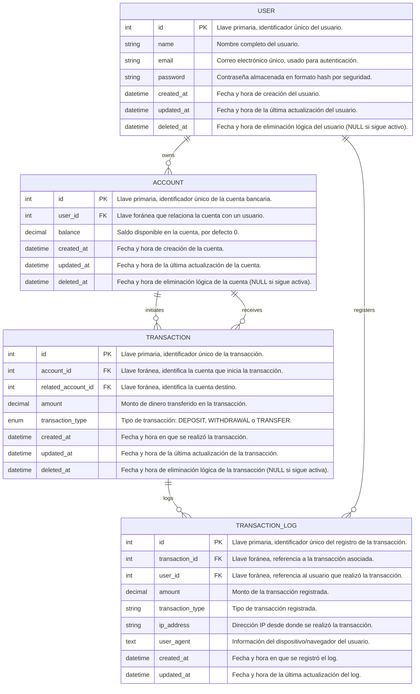

# Banck transactions

Software for participation registration

## Overview

This application provides a secure and efficient way to manage user records with the following features:

- User authentication and authorization
- Complete MVC for user management
- **Fully responsive design** using native CSS
- **Real-time updates**
- Secure password handling

---

## Tech Stack

- **code** PHP
- **Database:** MySQL

## Prerequisites

Make sure you have the following installed on your system:

- PHP >= 8.1
- MySQL


## Installation

1. **Clone the Repository**:

```bash
git clone https://github.com/castell482/devMegared.git
cd devMegared
```

2. **Configure Environment Variables**:

```bash
cp .env.example .env
```

3. **Set Up Database Configuration**:
   Edit the `.env` file with your database credentials:

```env
ROOT_PASSWORD=root
DB_HOST=127.0.0.1
DB_PORT=3306
DB_DATABASE=megared
DB_USERNAME=root
DB_PASSWORD=
DB_CHARSET=utf8mb4
```

4. **Run Database Migrations**:

```bash
php .\database\migrate.php
```
```bash
 php .\database\seed.php```
```

### Responsive Design

- The application is fully responsive, ensuring a seamless user experience across devices, from desktops to smartphones.


### Authentication

- Secure login system
- Session management


### Crededentials
-email:admin@example.com
-password:Qwerty1234

- Secure login system
- Session management


# ER Diagram




# Author

* **Carlos Castellanos** - *Developer* - [Github](https://github.com/castell482)  - [linkedin](www.linkedin.com/in/carlos-mario-castellanos-81b3241a1)

## License

This project is open-sourced software licensed under the [MIT license](https://opensource.org/licenses/MIT).
